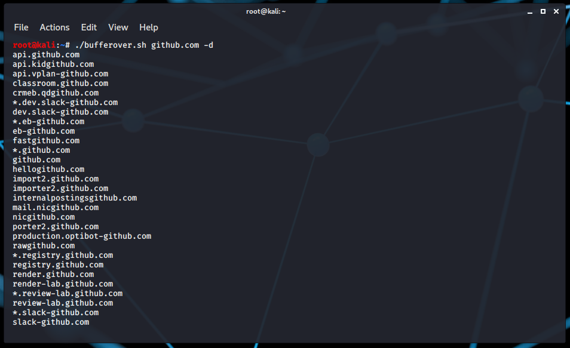
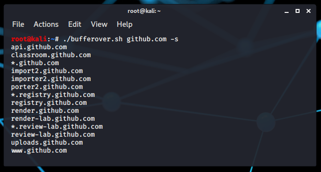
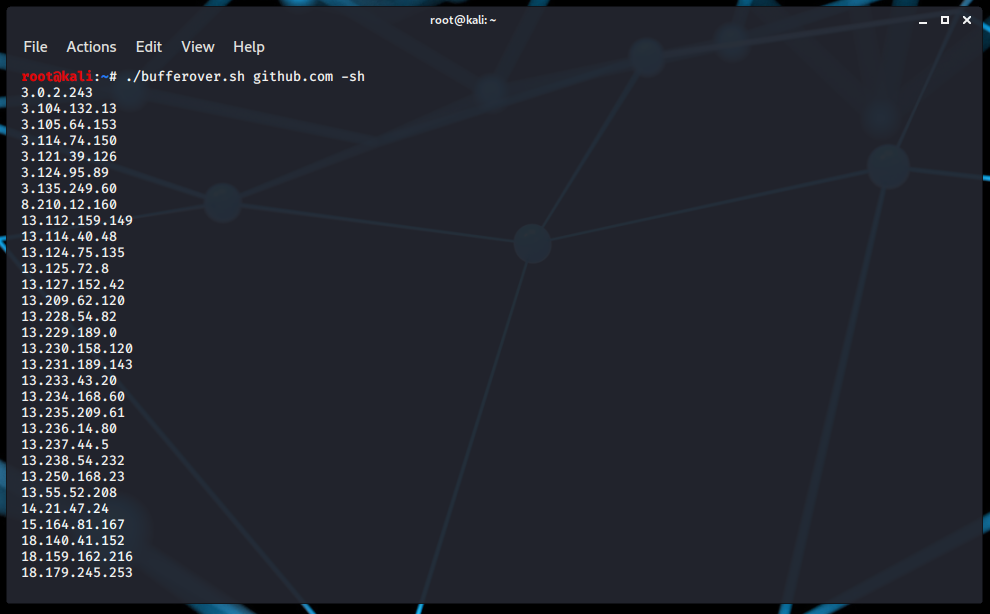

# bufferover • 
A DNS data extractor for penetration testers

# Installation
- Install [jq](https://github.com/stedolan/jq) utility
- git clone github.com/ahzsec/bufferover.git
- `cp bufferover.sh /usr/bin/bufferover`

# Usage
Option        | Description
------------- |-------------
-d            | Domains Extraction
-h            | Hosts Extraction
-s            | Subdomains Extraction
-sh           | Subdomains Hosts Extraction
-o            | Outfiling Data

## Examples

- Domains extraction:
```
bufferover github.com -d
```


- Subdomains extraction:
```
bufferover github.com -s
```


- Subdomains hosts extraction:
```
bufferover github.com -sh
```


- Data Outfiling:
```
bufferover github.com -d -o file.txt
```

# License
[](https://github.com/ahzsec/bufferover/blob/main/LICENSE.md)